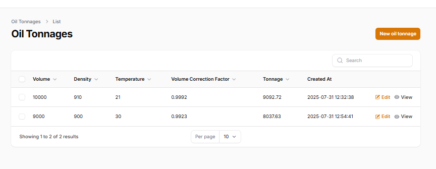
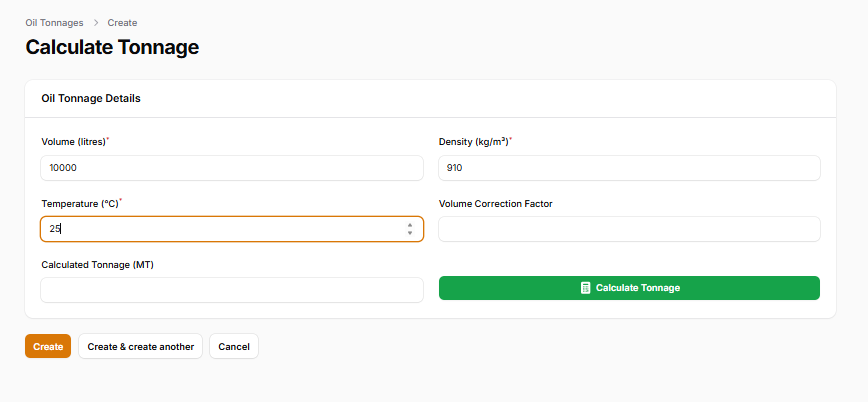
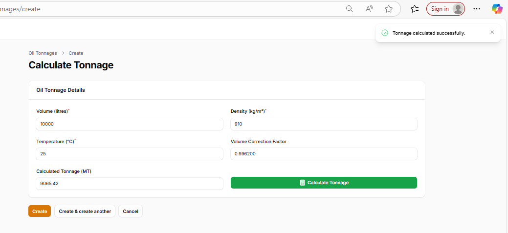

# Edible Oil Tonnage Calculator

## Features

- Calculate tonnage using:
  - Volume (in litres)
  - Density (in kg/m³)
  - Temperature (in °C)
## Setup Instructions

### 1. Clone the Repository

git clone https://github.com/keith-kay/sysdev_practical.git
cd sysdev_practical

### 2. Install Dependencies
composer install

### 3. Configure Environment
.env

### 4. Import Database
-Import the sysdev_practical.sql file into your MySQL server.

### 5. Generate Application Key
-php artisan key:generate

### 6. Run Application
-php artisan serve
-http://127.0.0.1:8000/admin/login to access the application.

### 7. User Login
-Username: admin@123.com

-Password: admin@2025

